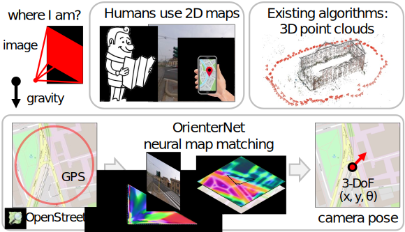
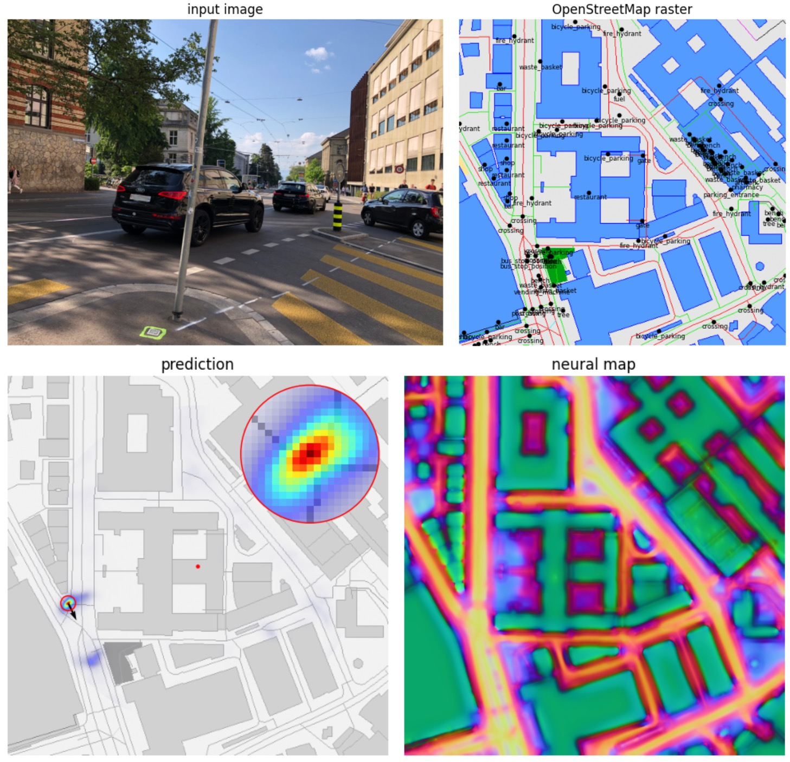

<p align="center">
  <h1 align="center"><ins>OrienterNet</ins><br>Visual Localization in 2D Public Maps<br>with Neural Matching</h1>
  <p align="center">
    <a href="https://psarlin.com/">Paul-Edouard&nbsp;Sarlin</a>
    ·
    <a href="https://danieldetone.com/">Daniel&nbsp;DeTone</a>
    ·
    <a href="https://scholar.google.com/citations?user=WhISCE4AAAAJ&hl=en">Tsun-Yi&nbsp;Yang</a>
    ·
    <a href="https://scholar.google.com/citations?user=Ta4TDJoAAAAJ&hl=en">Armen&nbsp;Avetisyan</a>
    ·
    <a href="https://scholar.google.com/citations?hl=en&user=49_cCT8AAAAJ">Julian&nbsp;Straub</a>
    <br>
    <a href="https://tom.ai/">Tomasz&nbsp;Malisiewicz</a>
    ·
    <a href="https://scholar.google.com/citations?user=484sccEAAAAJ&hl=en">Samuel&nbsp;Rota&nbsp;Bulo</a>
    ·
    <a href="https://scholar.google.com/citations?hl=en&user=MhowvPkAAAAJ">Richard&nbsp;Newcombe</a>
    ·
    <a href="https://scholar.google.com/citations?hl=en&user=CxbDDRMAAAAJ">Peter&nbsp;Kontschieder</a>
    ·
    <a href="https://scholar.google.com/citations?user=AGoNHcsAAAAJ&hl=en">Vasileios&nbsp;Balntas</a>
  </p>
  <h2 align="center">CVPR 2023</h2>
	<h3 align="center"><a href="https://colab.research.google.com/drive/1zH_2mzdB18BnJVq48ZvJhMorcRjrWAXI?usp=sharing">Demo</a> | <a href="https://arxiv.org/pdf/2304.02009.pdf">Paper</a> | <a href="https://psarlin.com/orienternet">Project Page</a> | <a href="https://youtu.be/wglW8jnupSs">Video</a></h3>
  <div align="center"></div>
</p>
<p align="center">
    <a href="https://psarlin.com/orienternet"></a>
    <br>
    <em>OrienterNet is a deep neural network that can accurately localize an image<br>using the same 2D semantic maps that humans use to orient themselves.</em>
</p>

##

This repository hosts the source code for OrienterNet, a research project by Meta Reality Labs. OrienterNet leverages the power of deep learning to provide accurate positioning of images using free and globally-available maps from OpenStreetMap. As opposed to complex existing algorithms that rely on 3D point clouds, OrienterNet estimates a position and orientation by matching a neural Bird's-Eye-View with 2D maps.

## Installation

OrienterNet requires Python >= 3.8 and [PyTorch](https://pytorch.org/).  To run the demo, clone this repo and install the minimal requirements:

```bash
git clone https://github.com/facebookresearch/OrienterNet
python -m pip install -r requirements/demo.txt
```

To run the evaluation and training, install the full requirements:

```bash
python -m pip install -r requirements/full.txt
```

## Demo ➡️ [](https://colab.research.google.com/drive/1zH_2mzdB18BnJVq48ZvJhMorcRjrWAXI?usp=sharing)

Check out the Jupyter notebook [`demo.ipynb`](./demo.ipynb) ([run it on Colab!](https://colab.research.google.com/drive/1zH_2mzdB18BnJVq48ZvJhMorcRjrWAXI?usp=sharing)) for a minimal demo - take a picture with your phone in any city and find its exact location in a few seconds!

<p align="center">
    <a href="./demo.ipynb"></a>
    <br>
    <em>OrienterNet positions any image within a large area - try it with your own images!</em>
</p>

## Evaluation

#### Mapillary Geo-Localization dataset

<details>
<summary>[Click to expand]</summary>

To obtain the dataset:

1. Create a developper account at [mapillary.com](https://www.mapillary.com/dashboard/developers) and obtain a free access token.
2. Run the following script to download the data from Mapillary and prepare it:

```bash
python -m maploc.data.mapillary.prepare --token $YOUR_ACCESS_TOKEN
```

By default the data is written to the directory `./datasets/MGL/`. Then run the evaluation with the pre-trained model:

```bash
python -m maploc.evaluation.mapillary --experiment OrienterNet_MGL model.num_rotations=256
```

This downloads the pre-trained models if necessary. The results should be close to the following:

```
Recall xy_max_error: [14.37, 48.69, 61.7] at (1, 3, 5) m/°
Recall yaw_max_error: [20.95, 54.96, 70.17] at (1, 3, 5) m/°
```

This requires a GPU with 11GB of memory. If you run into OOM issues, consider reducing the number of rotations (the default is 256):

```bash
python -m maploc.evaluation.mapillary --experiment OrienterNet_MGL \
    model.num_rotations=128
```

To export visualizations for the first 100 examples:

```bash
python -m maploc.evaluation.mapillary --experiment OrienterNet_MGL \
    --output_dir ./viz_MGL/ --num 100 
```

To run the evaluation in sequential mode (by default with 10 frames):

```bash
python -m maploc.evaluation.mapillary --experiment OrienterNet_MGL --sequential
```

</details>

#### KITTI dataset

<details>
<summary>[Click to expand]</summary>

1. Download and prepare the dataset to `./datasets/kitti/`:

```bash
python -m maploc.data.kitti.prepare
```

2. Run the evaluation with the model trained on MGL:

```bash
python -m maploc.evaluation.kitti --experiment OrienterNet_MGL
```

You should expect the following results:

```
Recall directional_error: [[50.33, 85.18, 92.73], [24.38, 56.13, 67.98]] at (1, 3, 5) m/°
Recall yaw_max_error: [29.22, 68.2, 84.49] at (1, 3, 5) m/°
```

You can similarly export some visual examples:

```bash
python -m maploc.evaluation.kitti --experiment OrienterNet_MGL \
    --output_dir ./viz_KITTI/ --num 100 
```

</details>

#### Aria Detroit & Seattle

We are currently unable to release the dataset used to evaluate OrienterNet in the CVPR 2023 paper.

## Training

#### MGL dataset

We trained the model on the MGL dataset using 3x 3090 GPUs (24GB VRAM each) and a total batch size of 12 for 340k iterations (about 3-4 days) with the following command:

```bash
python -m maploc.train experiment.name=OrienterNet_MGL_reproduce
```

Feel free to use any other experiment name. Configurations are managed by [Hydra](https://hydra.cc/) and [OmegaConf](https://omegaconf.readthedocs.io) so any entry can be overridden from the command line. You may thus reduce the number of GPUs and the batch size via:

```bash
python -m maploc.train experiment.name=OrienterNet_MGL_reproduce
  experiment.gpus=1 data.loading.train.batch_size=4
```

Be aware that this can reduce the overall performance. The checkpoints are written to `./experiments/experiment_name/`. Then run the evaluation:

```bash
# the best checkpoint:
python -m maploc.evaluation.mapillary --experiment OrienterNet_MGL_reproduce
# a specific checkpoint:
python -m maploc.evaluation.mapillary \
    --experiment OrienterNet_MGL_reproduce/checkpoint-step=340000.ckpt
```

#### KITTI

To fine-tune a trained model on the KITTI dataset:

```bash
python -m maploc.train experiment.name=OrienterNet_MGL_kitti data=kitti \
    training.finetune_from_checkpoint='"experiments/OrienterNet_MGL_reproduce/checkpoint-step=340000.ckpt"'
```

## Interactive development

We provide several visualization notebooks:

- [Visualize predictions on the MGL dataset](./notebooks/visualize_predictions_mgl.ipynb)
- [Visualize predictions on the KITTI dataset](./notebooks/visualize_predictions_kitti.ipynb)
- [Visualize sequential predictions](./notebooks/visualize_predictions_sequences.ipynb)

## OpenStreetMap data

<details>
<summary>[Click to expand]</summary>

To make sure that the results are consistent over time, we used OSM data downloaded from [Geofabrik](https://download.geofabrik.de/) in November 2021. By default, the dataset scripts `maploc.data.[mapillary,kitti].prepare` download pre-generated raster tiles. If you wish to use different OSM classes, you can pass `--generate_tiles`, which will download and use our prepared raw `.osm` XML files. You may alternatively download more recent files.

</details>

## License

The MGL dataset is made available under the [CC-BY-SA](https://creativecommons.org/licenses/by-sa/4.0/) license following the data available on the Mapillary platform. The model implementation and the pre-trained weights follow a [CC-BY-NC](https://creativecommons.org/licenses/by-nc/2.0/) license. [OpenStreetMap data](https://www.openstreetmap.org/copyright) is licensed under the [Open Data Commons Open Database License](https://opendatacommons.org/licenses/odbl/).

## BibTex citation

Please consider citing our work if you use any code from this repo or ideas presented in the paper:
```
@inproceedings{sarlin2023orienternet,
  author    = {Paul-Edouard Sarlin and
               Daniel DeTone and
               Tsun-Yi Yang and
               Armen Avetisyan and
               Julian Straub and
               Tomasz Malisiewicz and
               Samuel Rota Bulo and
               Richard Newcombe and
               Peter Kontschieder and
               Vasileios Balntas},
  title     = {{OrienterNet: Visual Localization in 2D Public Maps with Neural Matching}},
  booktitle = {CVPR},
  year      = {2023},
}
```


